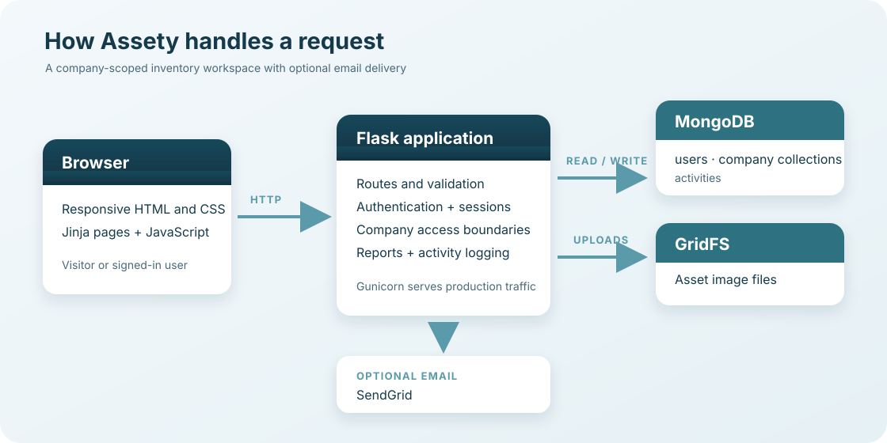

# Assety

Assety is a responsive inventory and asset-management web application for small organisations. Users can keep a searchable register of equipment, organise it by category and location, review activity, and export reports. It was built as a Code Institute Diploma in Full Stack Software Development Milestone Project 3.

> This repository contains the application and its local development setup. Local work is not automatically deployed: review the changes, run the checks, then commit and push when ready. See [CHANGELOG.md](CHANGELOG.md) for the current local change groups and [local-testing.md](local-testing.md) for this Windows checkout's start, stop, and test instructions.

## Table of contents

- [At a glance](#at-a-glance)
- [Screens and illustrations](#screens-and-illustrations)
- [Features](#features)
- [How the application works](#how-the-application-works)
- [Routes](#routes)
- [Technology](#technology)
- [Repository layout](#repository-layout)
- [Run locally](#run-locally)
- [Configuration](#configuration)
- [Testing and quality checks](#testing-and-quality-checks)
- [Deploy to Heroku](#deploy-to-heroku)
- [Security and data notes](#security-and-data-notes)
- [Known project scope](#known-project-scope)
- [Credits](#credits)

## At a glance

| | |
| --- | --- |
| Application | Flask server-rendered web app with progressive JavaScript enhancements |
| Persistence | MongoDB and GridFS |
| Intended users | Small teams managing their own organisation's assets |
| Main records | Assets, categories, locations, accounts, activity events |
| Local development | Python 3.12, MongoDB, and Node.js for JavaScript tests |
| Production entry point | Gunicorn, configured by `Procfile` for Heroku |

## Screens and illustrations

The landing page introduces the product and its workflow. The image below is a bundled hero photograph used by the public-facing design.


The following diagram shows the main request and storage relationships. Users authenticate through Flask; the account's company determines the inventory collection, while uploaded images use MongoDB GridFS.



Assety also bundles three feature illustrations used by the public pages: [inventory illustration](static/img/features1.svg), [organisation illustration](static/img/features2.svg), and [reporting illustration](static/img/features3.svg). The current responsive brand mark is [`static/img/assety-mark.svg`](static/img/assety-mark.svg); the older `logo.png` file is retained as an unused legacy asset. The empty-image placeholder is also in [`static/img`](static/img/).

## Features

### Public pages and accounts

- **Landing page and pricing section:** explains the product, workflow, and project plan. The Pricing link navigates to the plan section; this educational project does not provide paid checkout.
- **Sign-up and sign-in:** account creation and password-based authentication, with company association for separating inventory.
- **Password recovery:** request a reset email and use a time-limited token to set a new password. Email delivery needs SendGrid configuration.
- **Profile:** view and update profile details.
- **Email change:** Settings accepts a new address only after the user supplies the current account password. Invalid and already-used addresses are rejected.

### Inventory workspace

- **Dashboard:** asset/category/location counts, recent assets, recent activity, and quick links.
- **Assets:** add, view, edit, and delete inventory records. Asset information includes an asset tag, model/serial details, purchase information, category, location, and optional image, subject to the form fields.
- **Image uploads:** image files are validated and stored in MongoDB GridFS; the application serves them through an authenticated image route.
- **Categories and locations:** maintain reusable organisation-specific values and edit or remove them.
- **Search:** search by asset tag, including live suggestions in the workspace.
- **Reports:** review inventory reporting and export supported report formats.
- **Activity logs:** view and filter recorded actions, and export log data.

### Preferences and responsive interface

- **Settings:** dark mode, automatic logout timeout, email notifications, language, and currency preferences.
- **Translations:** UI strings are centralised in `translations.py`; English is the default. Availability of translated strings depends on the translation dictionary.
- **Responsive layouts:** public pages, account forms, workspace navigation, dashboards, lists, forms, reports, logs, profile, settings, and embedded forms adapt to phone, tablet, and desktop screens. Wide record tables contain their overflow rather than widening the entire page.
- **Accessibility-minded interactions:** keyboard-operable navigation and modal controls, visible form feedback, and focus handling are included in the client-side behavior.

## How the application works

Flask renders pages from Jinja templates in `templates/`. Shared settings and translation values are provided to templates, and JavaScript in `static/scripts/` adds interactions such as navigation, search suggestions, password validation, dashboard behavior, and inactivity warnings. `static/css/styles.css` provides the core styling; `static/css/responsive.css` contains responsive overrides.

MongoDB is the source of truth. The `users` collection stores account records. Each account has a `company` value; the application uses that value as the collection name for that company's inventory data. Those company collections contain mixed document types distinguished by flags (`asset`, `category`, or `location`). Assets refer to categories and locations by name. Activity events are stored in the shared `activities` collection and include company context.

| Data store | Contents |
| --- | --- |
| `users` | User credentials (password hashes), company association, profile, and preferences |
| Company-named collection | Assets, categories, and locations belonging to that company |
| `activities` | Asset-related activity events, with company and user context |
| GridFS bucket | Uploaded asset images, referenced by image ID from asset records |

## Routes

The table describes the main page and action routes in `app.py`. Some actions accept POST requests, and authenticated workspace routes require a signed-in account.

| Area | Routes |
| --- | --- |
| Public and authentication | `/`, `/sign-up`, `/login`, `/logout`, `/forgot-password`, `/reset_password/<token>` |
| Workspace | `/inventory`, `/dashboard`, `/assets`, `/asset/<asset_id>`, `/search`, `/search_assets` |
| Asset actions | `/new-asset`, `/save_asset`, `/asset-properties`, `/delete_asset/<asset_id>`, `/image/<image_id>` |
| Categories | `/categories`, `/new-category`, `/save_category`, `/category-properties`, `/delete_category/<category_id>` |
| Locations | `/locations`, `/new-location`, `/save-location`, `/location-properties`, `/delete_location/<location_id>` |
| Reports and logs | `/reports`, `/reports/export/<file_format>`, `/logs`, `/logs/export` |
| Account and preferences | `/profile`, `/update-profile`, `/change-email`, `/settings`, `/save-settings` |

## Technology

- **Backend:** Python 3.12, Flask, Flask-PyMongo, PyMongo, Flask-WTF/CSRFProtect, Werkzeug password hashing, itsdangerous reset tokens.
- **Database and files:** MongoDB, BSON ObjectIds, MongoDB GridFS.
- **Frontend:** Jinja, HTML, CSS, vanilla JavaScript, responsive stylesheets.
- **Email:** SendGrid integration in `send_emails.py` (optional for local operation; needed for delivered reset and notification messages).
- **Exports and images:** FPDF for PDF reports, Python CSV support, Pillow for image validation/processing.
- **Production server:** Gunicorn.
- **Client-side tests:** Jest with jsdom.
- **Python quality tools:** unittest integration tests and Ruff; HTML/CSS validation helpers are available in the local tooling.

Runtime dependencies are pinned in [`requirements.txt`](requirements.txt); development dependencies are in [`requirements-dev.txt`](requirements-dev.txt). `package.json` and `package-lock.json` define the JavaScript test setup.

## Repository layout

```text
.
├── app.py                    Flask routes, validation, persistence, and exports
├── settings.py               Environment-based app configuration
├── send_emails.py            Optional SendGrid email service
├── translations.py           Central UI translations
├── templates/                Jinja pages and reusable form/modal templates
├── static/
│   ├── css/                  Base and responsive stylesheets
│   ├── img/                  Logo, public illustrations, and image placeholder
│   └── scripts/              Navigation, search, dashboard, idle, and tests
├── tests/                    Python integration tests
├── scripts/                  Local server and quality-check helpers
├── docs/images/              Documentation diagrams
├── Procfile                  Heroku Gunicorn command
├── CHANGELOG.md              Local work grouped for review
└── local-testing.md          Windows local setup and responsive QA notes
```

## Run locally

For this prepared Windows checkout, the easiest workflow is:

```cmd
start-local.cmd
```

Then open <http://127.0.0.1:5001> and create a test account. Stop the services with `stop-local.cmd`; run the repeatable test set with `test-local.cmd`. The launcher uses a separate development MongoDB on port `27019` and database `assety_dev`. It does not copy production/Heroku accounts or data. Details, troubleshooting, and local safety behavior are documented in [local-testing.md](local-testing.md).

For a fresh environment, use Python 3.12 (the version in `.python-version`), create a virtual environment, install Python packages, configure MongoDB, and start the Flask development server:

```bash
python -m venv .venv
source .venv/bin/activate  # Windows CMD: .venv\\Scripts\\activate
python -m pip install -r requirements.txt
python app.py
```

Install Node.js dependencies only when running the JavaScript tests:

```bash
npm ci
```

The default Flask development server uses port `5000`. Set `FLASK_DEBUG=1` only for local debugging. Provide the configuration below before starting if no MongoDB URI/database is otherwise configured.

## Configuration

| Variable | Required? | Purpose |
| --- | --- | --- |
| `MONGO_URI` | Yes | MongoDB connection URI. For example, local MongoDB may use `mongodb://127.0.0.1:27017/assety_dev`; use the configured Atlas URI in production. |
| `MONGO_DBNAME` | Conditional | Database name. Can be omitted if the URI includes a database name. It is not the Atlas cluster name. |
| `SECRET_KEY` | Production | Flask session and signing key. Heroku must have a stable secret configured. Local development generates a temporary random key if unset, so sessions do not survive app restarts. |
| `SENDGRID_API_KEY` | Optional | SendGrid API credential for outbound emails. |
| `MAIL_DEFAULT_SENDER` | Optional with email | Verified sender address used by SendGrid. |
| `FLASK_DEBUG` | Optional local | Set to `1` to enable Flask debug mode outside Heroku. |
| `ASSETY_TEST_MONGO_URI` | Optional tests | MongoDB server URI for integration tests. Use only a server intended for disposable test databases. |

Generate a secret with `python -c "import secrets; print(secrets.token_hex(32))"`. Keep MongoDB credentials and signing keys out of source control. The prepared Windows launcher explicitly disables email delivery and directs the app at its local database.

## Testing and quality checks

Run the Python integration suite against a MongoDB server intended for tests:

```bash
python -m unittest discover -s tests -v
```

The suite uses a uniquely named temporary database and removes it afterward. It covers signup/login and recovery, settings/profile validation, account/company boundaries, assets and image handling, categories and locations, search, activity filtering/pagination, PDF exports, and production startup configuration. Set `ASSETY_TEST_MONGO_URI` if the test MongoDB server is not at `mongodb://127.0.0.1:27017`.

Run the browser-side unit tests with:

```bash
npm ci
npm test
```

Jest/jsdom tests cover password feedback, login/reset compatibility, inactivity warning and timeout behavior, mobile navigation, keyboard behavior, and search interactions. For the prepared Windows environment, `test-local.cmd` runs the project test workflow and preserves the local development database.

The local QA workflow also uses Ruff, renders representative routes, and checks generated HTML and project stylesheets. To review responsive behavior manually, test narrow phone widths through desktop, expand/collapse the sidebar, use the Categories submenu and modal forms, and check both light and dark modes. See [local-testing.md](local-testing.md) for the recorded responsive regression matrix.

## Deploy to Heroku

The `Procfile` starts the app with Gunicorn and binds to Heroku's assigned `$PORT`. Configure `MONGO_URI`, `MONGO_DBNAME` if the URI does not identify the database, and `SECRET_KEY` in Heroku Config Vars. Ensure the MongoDB/Atlas database user and network-access rules allow the app to connect. Configure `SENDGRID_API_KEY` and `MAIL_DEFAULT_SENDER` only when outbound email is required.

After deployment, inspect startup output with `heroku logs --tail --app YOUR_APP_NAME`. Changing `SECRET_KEY` invalidates current sessions and signed password-reset tokens. Company names are used verbatim as MongoDB collection keys; historical records written under a different naming convention need deliberate review before any migration.

## Security and data notes

- Passwords are stored as Werkzeug password hashes, not plaintext.
- State-changing forms use Flask-WTF CSRF protection.
- Authenticated routes scope inventory operations to the signed-in user's company, with checks around record access and image retrieval.
- Email changes require the current password; form input and asset uploads are validated.
- Sessions use HTTP-only and `SameSite=Lax` cookies. Secure cookies are enabled in the Heroku production environment.
- Responses include basic content-type, frame, and referrer-policy headers; authenticated/non-static responses are marked `no-store`.
- The app limits request bodies/uploads to 16 MiB and returns user-facing error pages for common HTTP errors.
- Local test data is separate from production. Back up production data independently; this repository does not copy or manage Atlas backups.

## Known project scope

Assety is an educational project rather than a commercial subscription service. The landing-page Pricing section describes the current free project plan and points to signup; it does not charge users. Email depends on a configured SendGrid account. The language preference and translation dictionary are the source for translated interface text, and individual labels may fall back to English where a translation is not defined.

## Credits

Created for the Code Institute Diploma in Full Stack Software Development. The project uses Flask, MongoDB, SendGrid, Jest, and other open-source libraries listed in the dependency manifests. Public-page images and illustrations are bundled in `static/img/`; consult their source/license metadata when redistributing the project outside its educational context.
